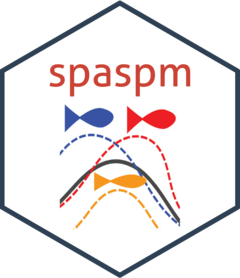

<!-- README.md is generated from README.Rmd. Please edit that file -->

# sspm



<!-- badges: start -->

[](https://opensource.org/licenses/MIT/)
[](https://github.com/pedersen-fisheries-lab/sspm/actions)
[](https://app.codecov.io/gh/pedersen-fisheries-lab/sspm)
<!-- [](https://CRAN.R-project.org/package=sspm/)
[](https://github.com/pedersen-fisheries-lab/sspm/releases/latest)
[](https://CRAN.R-project.org/package=sspm)
[](https://github.com/pedersen-fisheries-lab/sspm/blob/dev/DESCRIPTION) -->
<!-- badges: end -->

The goal of `sspm` is to implement a gam-based spatial surplus
production model, aimed at modeling northern shrimp population in Canada
but potentially to any stock in any location. The package is opinionated
in its implementation of SPMs as it internally makes the choice to use
penalized spatial gams with time lags based on Pedersen et al. (2020).
However, it also aims to provide options for the user to customize their
model.

## Installation

You can install the released version of sspm from
[CRAN](https://CRAN.R-project.org) with:

``` r
install.packages("sspm")
```

You can install the development version from
[GitHub](https://github.com/) with:

``` r
# install.packages("devtools")
devtools::install_github("pedersen-fisheries-lab/sspm")
# if you wish to build the vignettes:
devtools::install_github("pedersen-fisheries-lab/sspm", build_vignettes = TRUE)
```

## Vignettes

See the vignettes for an introduction to the `sspm` workflow.

``` r
browseVignettes("sspm")
```
