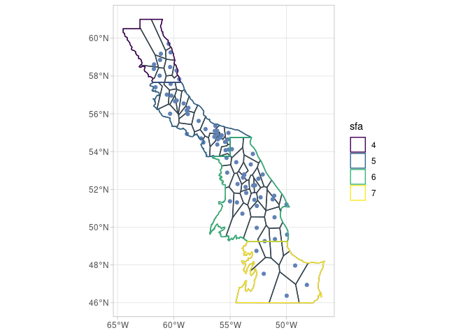
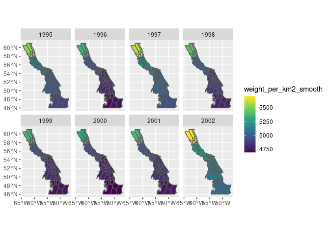

<!-- README.md is generated from README.Rmd. Please edit that file -->

# sspm 

<!-- badges: start -->

[](https://opensource.org/licenses/MIT/)
[](https://github.com/pedersen-fisheries-lab/sspm/actions)
[](https://codecov.io/gh/pedersen-fisheries-lab/sspm?branch=main)
<!-- [](https://CRAN.R-project.org/package=sspm/)
[](https://github.com/pedersen-fisheries-lab/sspm/releases/latest)
[](https://CRAN.R-project.org/package=sspm)
[](https://github.com/pedersen-fisheries-lab/sspm/blob/dev/DESCRIPTION) -->
<!-- badges: end -->

The goal of `sspm` is to implement a gam-based spatial surplus
production model, aimed at modeling northern shrimp population in Canada
but potentially to any stock in any location. The package is opinionated
in its implementation of SPMs as it internally makes the choice to use
penalized spatial gams with time lags based on Pedersen et al. (2020).
However, it also aims to provide options for the user to customize their
model.

## Installation

<!-- You can install the released version of sspm from [CRAN](https://CRAN.R-project.org) with: -->
<!-- ``` r -->
<!-- install.packages("sspm") -->
<!-- ``` -->

You can install the development version from
[GitHub](https://github.com/) with:

``` r
# install.packages("devtools")
devtools::install_github("pedersen-fisheries-lab/sspm")
```

## Example

The following example shows the typical `sspm` workflow. The API is
subject to changes as the package is still in development.

Let’s first load the packages and the test data.

``` r
library(sspm)
#> Loading required package: sf
#> Linking to GEOS 3.8.1, GDAL 3.1.3, PROJ 7.1.0
#> Loading required package: mgcv
#> Loading required package: nlme
#> This is mgcv 1.8-36. For overview type 'help("mgcv-package")'.
library(mgcv)

borealis <- sspm:::borealis_simulated
predator <- sspm:::predator_simulated
catch <- sspm:::catch_simulated

sfa_boundaries <- sspm:::sfa_boundaries
```

1.  The first step of the `sspm` workflow is to create a `sspm_boundary`
    from an `sf` object, providing the `boundary_column` that delineates
    the boundary regions. The object can then be plotted with `spm_plot`
    (as can most `sspm` objects).

``` r
bounds <- spm_as_boundary(boundaries = sfa_boundaries, 
                          boundary_column = "sfa")

spm_plot(bounds)
```


2.  The second step consists in wrapping a `data.frame`, `tibble` or
    `sf` object into a `sspm_data` object, with a few other pieces of
    relevant information, such as the name, dataset type (biomass,
    predictor or catch, depending on the type of information contained),
    time column and coordinates column (i not `sf`) and unique row
    identifier. Here we wrap the borealis dataset that contains the
    biomass information.

``` r
biomass_dataset <- 
  spm_as_dataset(borealis, name = "borealis", 
                 type = "biomass", time_column = "year_f",
                 coords = c('lon_dec','lat_dec'), uniqueID = "uniqueID")
#> ℹ  Casting data matrix into simple feature collection using columns: lon_dec, lat_dec
#> !  Warning: sspm is assuming WGS 84 CRS is to be used for casting

biomass_dataset
#> 
#> ‒‒ SSPM Dataset: borealis (biomass) ‒‒
#> →  Data              : [1541 observations, 18 variables]
#> →  Data unique ID    : uniqueID
#> →  Time col.         : year_f
#> →  Coordinates cols. : lon_dec, lat_dec
```

3.  We do the same with the predator and catch data.

``` r
predator_dataset <- 
  spm_as_dataset(predator, name = "all_predators", 
                 type = "predictor", time_column = "year",
                 uniqueID = "uniqueID", coords = c("lon_dec", "lat_dec"))
#> ℹ  Casting data matrix into simple feature collection using columns: lon_dec, lat_dec
#> !  Warning: sspm is assuming WGS 84 CRS is to be used for casting

predator_dataset
#> 
#> ‒‒ SSPM Dataset: all_predators (predictor) ‒‒
#> →  Data              : [4833 observations, 15 variables]
#> →  Data unique ID    : uniqueID
#> →  Time col.         : year
#> →  Coordinates cols. : lon_dec, lat_dec

catch_dataset <- 
  spm_as_dataset(catch, name = "catch_data", 
                 type = "catch", time_column = "year_f", 
                 uniqueID = "uniqueID", coords = c("lon_start", "lat_start"))
#> ℹ  Casting data matrix into simple feature collection using columns: lon_start, lat_start
#> !  Warning: sspm is assuming WGS 84 CRS is to be used for casting

catch_dataset
#> 
#> ‒‒ SSPM Dataset: catch_data (catch) ‒‒
#> →  Data              : [88579 observations, 8 variables]
#> →  Data unique ID    : uniqueID
#> →  Time col.         : year_f
#> →  Coordinates cols. : lon_start, lat_start
```

4.  The `sspm` workflow relies on the discretization of the boundary
    objects, the default method being voronoi tesselation (only one
    method available currently, but see in the future see
    `?spm_methods()` for the list of methods available).

``` r
bounds_voronoi <- bounds %>% 
  spm_discretize(with = biomass_dataset, 
                 method = "tesselate_voronoi")
#> ℹ  Discretizing using method tesselate_voronoi

bounds_voronoi
#> 
#> ‒‒ SSPM Boundary (Discrete) ‒‒
#> →  Boundaries    : [4 observations, 2 variables]
#> →  Boundary col. : sfa
#> →  Discretized   : 
#>    ٭ Points — [75 features, 19 variables]
#>    ٭ Patches — [69 features, 4 variables]
```

5.  Plotting the object shows the polygons that have been created.

``` r
spm_plot(bounds_voronoi)
```



6.  The results of the discretization can also be explored with
    `spm_patches()` and `spm_points()`.

``` r
spm_patches(bounds_voronoi)
#> Simple feature collection with 69 features and 3 fields
#> Geometry type: POLYGON
#> Dimension:     XY
#> Bounding box:  xmin: -64.5 ymin: 46.00004 xmax: -46.6269 ymax: 61
#> Geodetic CRS:  WGS 84
#> # A tibble: 69 x 4
#>    sfa   patch_id                                              geometry area_km2
#>  * <chr> <fct>                                            <POLYGON [°]>    <dbl>
#>  1 4     V1       ((-64.4227 60.27125, -64.5 60.30667, -64.5 60.31667,…   20236.
#>  2 4     V2       ((-63 60.55308, -63 61, -62.96667 61, -62.93333 61, …   14675.
#>  3 4     V3       ((-59.91648 58.8388, -59.9052 58.80785, -59.9468 58.…    4127.
#>  4 4     V4       ((-59.88688 57.66667, -59.9 57.66667, -59.93333 57.6…    2742.
#>  5 4     V5       ((-62.00478 61, -62 61, -61.96667 61, -61.93333 61, …    5560.
#>  6 4     V6       ((-59.95436 58.6478, -59.9052 58.61004, -59.79427 58…    1515.
#>  7 4     V7       ((-61.86024 57.86301, -61.86024 57.87204, -61.94343 …    3819.
#>  8 4     V8       ((-61.37285 57.66667, -61.4 57.66667, -61.43333 57.6…    4376.
#>  9 4     V9       ((-61.36857 58.4628, -61.66155 59.11637, -60.6936 58…    2702.
#> 10 4     V10      ((-60.25027 59.52148, -60.18251 59.45455, -60.16864 …    2445.
#> # … with 59 more rows
spm_points(bounds_voronoi)
#> Simple feature collection with 75 features and 18 fields
#> Geometry type: POINT
#> Dimension:     XY
#> Bounding box:  xmin: -61.77175 ymin: 46.37211 xmax: -48.19061 ymax: 59.70288
#> Geodetic CRS:  WGS 84
#> # A tibble: 75 x 19
#> # Groups:   sfa [4]
#>     year vessel  trip div_nafo season area_swept_km2 year_f n_samples lon_dec
#>  * <dbl>  <dbl> <dbl> <chr>    <chr>           <dbl> <fct>      <dbl>   <dbl>
#>  1  1995     39    21 3K       Fall           0.0250 1995           5   -56.4
#>  2  1996     39    37 2G       Fall           0.0250 1996           5   -53.0
#>  3  1996     39    37 2G       Fall           0.0250 1996           5   -61.8
#>  4  1998     39    73 2H       Fall           0.0250 1998           5   -56.1
#>  5  1998     39    73 2J       Fall           0.0343 1998           5   -53.2
#>  6  1998     39    76 3L       Fall           0.0250 1998           5   -53.7
#>  7  1999     39    86 2J       Fall           0.0281 1999           5   -57.8
#>  8  1999     39    88 3K       Fall           0.0250 1999           5   -53.6
#>  9  2011     39    98 3K       Fall           0.0281 2011           5   -61.2
#> 10  2006     48   101 2G       Summer         0.0281 2006           5   -56.1
#> # … with 65 more rows, and 10 more variables: lat_dec <dbl>, depth <dbl>,
#> #   temp_at_bottom <dbl>, weight <dbl>, weight_per_km2 <dbl>,
#> #   recruit_weight <dbl>, row <int>, uniqueID <chr>, geometry <POINT [°]>,
#> #   sfa <chr>
```

7.  The next step in this workflow is to smooth the variables to be used
    in the final `sspm` model, by using spatial-temporal smoothers, by
    passing each dataset through `spm_smooth`. Here we first smooth
    `weight_per_km2` as well as `temp_at_bottom`. Note that the boundary
    column `sfa` can be used in the formula as the data will be first
    joined to the provided boundaries.

``` r
biomass_smooth <- biomass_dataset %>%  
  spm_smooth(weight_per_km2 ~ sfa + smooth_time(k = 3) + smooth_space(),
             boundaries = bounds_voronoi,
             drop.unused.levels = F, family=tw, method= "fREML") %>% 
  spm_smooth(temp_at_bottom ~ smooth_time(k = 2) + smooth_space(),
             drop.unused.levels = F, family=gaussian, method= "fREML")
#> ℹ  Fitting formula: weight_per_km2 ~ sfa + smooth_time(k = 3) + smooth_space() for dataset 'borealis'
#> ℹ  Fitting formula: temp_at_bottom ~ smooth_time(k = 2) + smooth_space() for dataset 'borealis'

biomass_smooth
#> 
#> ‒‒ SSPM Dataset: borealis (biomass) ‒‒
#> →  Data (MAPPED)     : [1026 observations, 21 variables]
#> →  Data unique ID    : uniqueID
#> →  Time col.         : year_f
#> →  Coordinates cols. : lon_dec, lat_dec
#> →  Formulas          : 
#>       – weight_per_km2 ~ sfa + smooth_time(k = 3) + smooth_space()
#>       – temp_at_bottom ~ smooth_time(k = 2) + smooth_space()
#> →  Boundaries        : [4 observations, 2 variables]
#> →  Smoothed Data     : [1656 observations, 8 variables]
#>    ٭ smoothed vars: temp_at_bottom_smooth — weight_per_km2_smooth
```

8.  The smoothed results for any smoothed variables (listed in “smoothed
    vars” above) can be easily plotted:

``` r
spm_plot(biomass_smooth, "weight_per_km2_smooth")
```



9.  We also smooth the `weight_per_km2` variable in the predator data.

``` r
predator_smooth <- predator_dataset %>%  
  spm_smooth(weight_per_km2 ~ smooth_time(k = 3) + smooth_space(),
             boundaries = bounds_voronoi,
             drop.unused.levels = F, family=tw, method= "fREML")
#> ℹ  Fitting formula: weight_per_km2 ~ smooth_time(k = 3) + smooth_space() for dataset 'all_predators'

predator_smooth
#> 
#> ‒‒ SSPM Dataset: all_predators (predictor) ‒‒
#> →  Data (MAPPED)     : [1979 observations, 18 variables]
#> →  Data unique ID    : uniqueID
#> →  Time col.         : year
#> →  Coordinates cols. : lon_dec, lat_dec
#> →  Formulas          : 
#>       – weight_per_km2 ~ smooth_time(k = 3) + smooth_space()
#> →  Boundaries        : [4 observations, 2 variables]
#> →  Smoothed Data     : [1656 observations, 7 variables]
#>    ٭ smoothed vars: weight_per_km2_smooth
```

10. Once data has been smoothed, we can assemble a `sspm` model object,
    using one dataset of type biomass, one dataset of type predictor and
    (optionnaly) a dataset of type catch. If we want to use a

``` r
sspm_model <- sspm(biomass = biomass_smooth, 
                   predictors = predator_smooth, 
                   catch = catch_dataset, 
                   catch_var = "catch", 
                   biomass_var = "weight_per_km2_smooth_borealis")
#> ℹ  Joining smoothed data from all datasets
#> ℹ  Offsetting biomass with catch data using columns: weight_per_km2_smooth_borealis, catch

sspm_model
#> 
#> ‒‒ SSPM Model (3 datasets) ‒‒
#> →  Smoothed Data     : [1656 observations, 12 variables]
#>    ٭ smoothed vars: temp_at_bottom_smooth — weight_per_km2_smooth_all_predators — weight_per_km2_smooth_borealis
#>    ٭ vars with catch: weight_per_km2_smooth_borealis_with_catch
```

11. Before fitting the model, we must split data into test/train with
    `spm_split`.

``` r
sspm_model <- sspm_model %>% 
  spm_split(year_f %in% c(1990:2017))

sspm_model
#> 
#> ‒‒ SSPM Model (3 datasets) ‒‒
#> →  Smoothed Data     : [1656 observations, 13 variables] / [1587 train, 69 test]
#>    ٭ smoothed vars: temp_at_bottom_smooth — weight_per_km2_smooth_all_predators — weight_per_km2_smooth_borealis
#>    ٭ vars with catch: weight_per_km2_smooth_borealis_with_catch
```

12. To fit the model, we might be interested in including lagged values.
    This is done with `spm_lag`.

``` r
sspm_model <- sspm_model %>% 
  spm_lag(vars = c("weight_per_km2_smooth_borealis_with_catch", "weight_per_km2_smooth_all_predators"), 
          n = 1)

sspm_model
#> 
#> ‒‒ SSPM Model (3 datasets) ‒‒
#> →  Smoothed Data     : [1656 observations, 15 variables] / [1587 train, 69 test]
#>    ٭ smoothed vars: temp_at_bottom_smooth — weight_per_km2_smooth_all_predators — weight_per_km2_smooth_borealis
#>    ٭ vars with catch: weight_per_km2_smooth_borealis_with_catch — weight_per_km2_smooth_borealis_with_catch_lag_1
#>    ٭ lagged vars: weight_per_km2_smooth_all_predators_lag_1 — weight_per_km2_smooth_borealis_with_catch_lag_1
```

13. We can now fit the final spm model with `spm`.

``` r
sspm_model_fit <- sspm_model %>% 
  spm(weight_per_km2_smooth_borealis_with_catch ~ temp_at_bottom_smooth + 
        weight_per_km2_smooth_all_predators_lag_1 + smooth_lag("weight_per_km2_smooth_borealis_with_catch"))
#> ℹ  Fitting SPM formula: weight_per_km2_smooth_borealis_with_catch ~ temp_at_bottom_smooth + weight_per_km2_smooth_all_predators_lag_1 + smooth_lag('weight_per_km2_smooth_borealis_with_catch')

sspm_model_fit
#> 
#> ‒‒ SSPM Model Fit ‒‒
#> →  Smoothed Data     : [1656 observations, 15 variables] / [1587 train, 69 test]
#> →  Fit summary       : 
#> 
#> Family: Scaled t(3.067,0.017) 
#> Link function: identity 
#> 
#> Formula:
#> weight_per_km2_smooth_borealis_with_catch ~ temp_at_bottom_smooth + 
#>     weight_per_km2_smooth_all_predators_lag_1 + s(lag_matrix, 
#>     k = 5, m = 1, by = by_matrix)
#> 
#> Parametric coefficients:
#>                                             Estimate Std. Error t value
#> (Intercept)                               -1.066e-01  4.652e-02  -2.291
#> temp_at_bottom_smooth                      5.477e-03  1.065e-03   5.142
#> weight_per_km2_smooth_all_predators_lag_1  2.177e-05  1.003e-05   2.171
#>                                           Pr(>|t|)    
#> (Intercept)                                 0.0221 *  
#> temp_at_bottom_smooth                     3.05e-07 ***
#> weight_per_km2_smooth_all_predators_lag_1   0.0301 *  
#> ---
#> Signif. codes:  0 '***' 0.001 '**' 0.01 '*' 0.05 '.' 0.1 ' ' 1
#> 
#> Approximate significance of smooth terms:
#>                           edf Ref.df   F p-value    
#> s(lag_matrix):by_matrix 4.982      5 314  <2e-16 ***
#> ---
#> Signif. codes:  0 '***' 0.001 '**' 0.01 '*' 0.05 '.' 0.1 ' ' 1
#> 
#> R-sq.(adj) =  0.261   Deviance explained = 36.2%
#> -REML = 2296.2  Scale est. = 1         n = 1587
```

14. Plotting the object produces a actual vs predicted plot (with
    TEST/TRAIN data highlighted.

``` r
spm_plot(sspm_model_fit)
```


