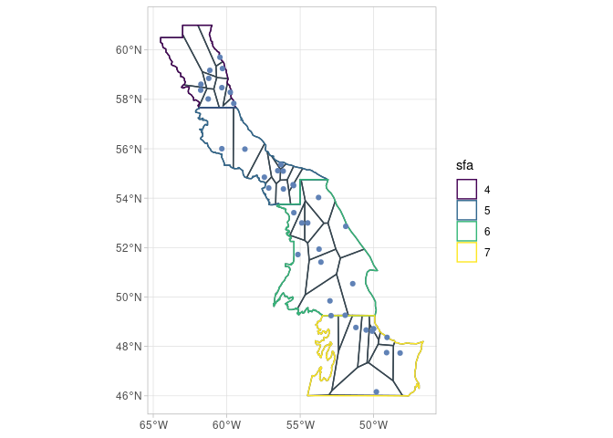
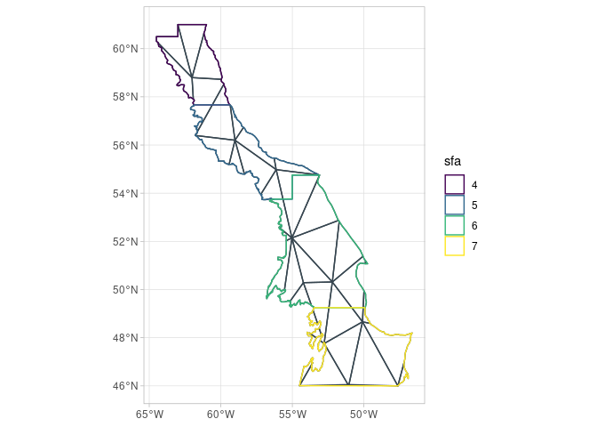
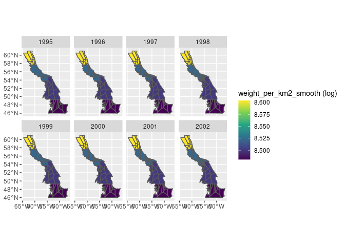
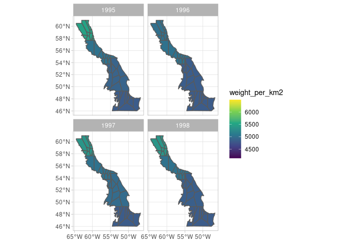
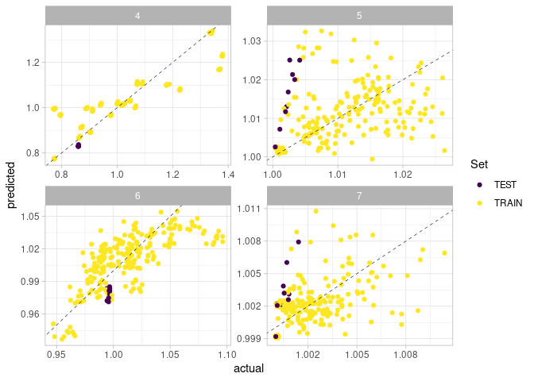
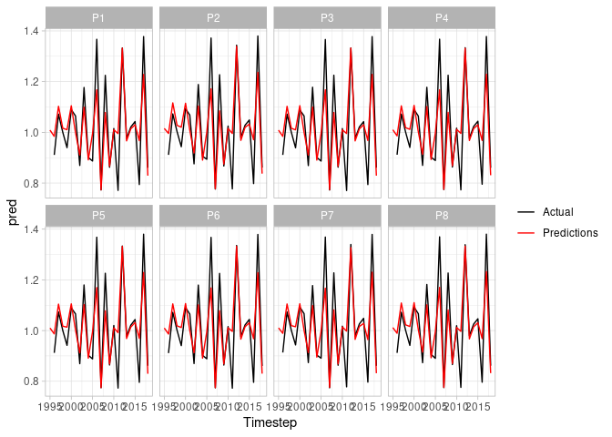
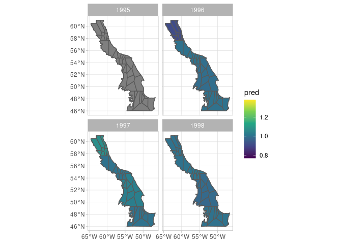
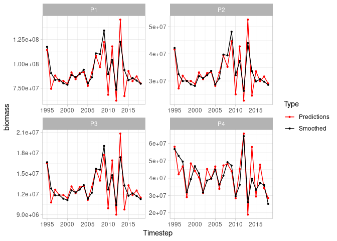
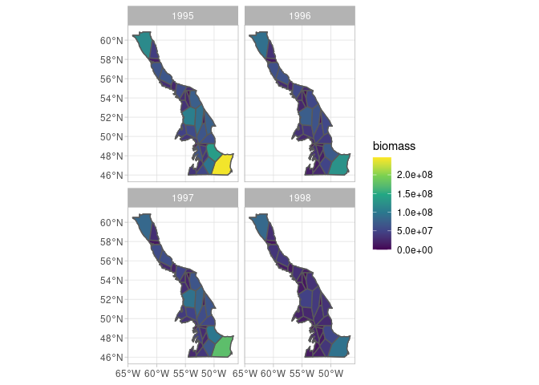
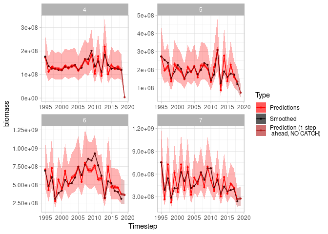

<!-- README.md is generated from README.Rmd. Please edit that file -->

# sspm 

<!-- badges: start -->

[](https://opensource.org/licenses/MIT/)
[](https://github.com/pedersen-fisheries-lab/sspm/actions)
[](https://codecov.io/gh/pedersen-fisheries-lab/sspm?branch=main)
<!-- [](https://CRAN.R-project.org/package=sspm/)
[](https://github.com/pedersen-fisheries-lab/sspm/releases/latest)
[](https://CRAN.R-project.org/package=sspm)
[](https://github.com/pedersen-fisheries-lab/sspm/blob/dev/DESCRIPTION) -->
<!-- badges: end -->

The goal of `sspm` is to implement a gam-based spatial surplus
production model, aimed at modeling northern shrimp population in Canada
but potentially to any stock in any location. The package is opinionated
in its implementation of SPMs as it internally makes the choice to use
penalized spatial gams with time lags based on Pedersen et al. (2020).
However, it also aims to provide options for the user to customize their
model.

## Installation

<!-- You can install the released version of sspm from [CRAN](https://CRAN.R-project.org) with: -->
<!-- ``` r -->
<!-- install.packages("sspm") -->
<!-- ``` -->

You can install the development version from
[GitHub](https://github.com/) with:

``` r
# install.packages("devtools")
devtools::install_github("pedersen-fisheries-lab/sspm")
```

## Example

The following example shows the typical `sspm` workflow. The API is
subject to changes as the package is still in development.

Let’s first load the packages and the test data.

``` r
library(sspm)
#> Loading required package: sf
#> Linking to GEOS 3.9.0, GDAL 3.2.2, PROJ 7.2.1; sf_use_s2() is TRUE
#> Loading required package: mgcv
#> Loading required package: nlme
#> This is mgcv 1.8-38. For overview type 'help("mgcv-package")'.
library(mgcv)
library(dplyr)
#> 
#> Attaching package: 'dplyr'
#> The following object is masked from 'package:nlme':
#> 
#>     collapse
#> The following objects are masked from 'package:stats':
#> 
#>     filter, lag
#> The following objects are masked from 'package:base':
#> 
#>     intersect, setdiff, setequal, union

borealis <- sspm:::borealis_simulated
predator <- sspm:::predator_simulated
catch <- sspm:::catch_simulated
sfa_boundaries <- sspm:::sfa_boundaries
```

1.  The first step of the `sspm` workflow is to create a `sspm_boundary`
    from an `sf` object, providing the `boundary` that delineates the
    boundary regions. The object can then be plotted with `spm_plot` (as
    can most `sspm` objects).

``` r
bounds <- spm_as_boundary(boundaries = sfa_boundaries, 
                          boundary = "sfa")

plot(bounds)
```


2.  The second step consists in wrapping a `data.frame`, `tibble` or
    `sf` object into a `sspm_data` object, with a few other pieces of
    relevant information, such as the name, dataset type (biomass,
    predictor or catch, depending on the type of information contained),
    time column and coordinates column (i not `sf`) and unique row
    identifier. Here we wrap the borealis dataset that contains the
    biomass information.

``` r
biomass_dataset <- 
  spm_as_dataset(borealis, name = "borealis",
                 density = "weight_per_km2",
                 time = "year_f",
                 coords = c('lon_dec','lat_dec'), 
                 uniqueID = "uniqueID")
#> ℹ  Casting data matrix into simple feature collection using columns: lon_dec, lat_dec
#> !  Warning: sspm is assuming WGS 84 CRS is to be used for casting

biomass_dataset
#> 
#> ‒‒ Dataset borealis ‒‒
#> →  [1800 rows, 9 columns]
#> →  Density : weight_per_km2
#> →  Time : year_f
```

3.  We do the same with the predator data, which are of the predictor
    type.

``` r
predator_dataset <- 
  spm_as_dataset(predator, name = "all_predators", 
                 density = "weight_per_km2",
                 time = "year_f",
                 coords = c("lon_dec", "lat_dec"),
                 uniqueID = "uniqueID")
#> ℹ  Casting data matrix into simple feature collection using columns: lon_dec, lat_dec
#> !  Warning: sspm is assuming WGS 84 CRS is to be used for casting

predator_dataset
#> 
#> ‒‒ Dataset all_predators ‒‒
#> →  [10200 rows, 8 columns]
#> →  Density : weight_per_km2
#> →  Time : year_f
```

4.  The `sspm` workflow relies on the discretization of the boundary
    objects, the default method being voronoi tesselation.

``` r
bounds_voronoi <- bounds %>% 
  spm_discretize(method = "tesselate_voronoi",
                 with = biomass_dataset, 
                 nb_samples = 30)
#> ℹ  Discretizing using method tesselate_voronoi

bounds_voronoi
#> 
#> ‒‒ Boundaries (Discrete) ‒‒
#> →  [4 rows, 3 columns]
#>   ٭ Points — [120 features, 11 columns]
#>   ٭ Patches — [35 features, 4 columns]
#> →  Column : sfa
#> →  Area : area_sfa
```

The other available method is `triangulate_delaunay` for delaunay
triangulation. Here the `a` argument is used to set the size of the mesh
(see `RTriangle::triangulate` for more details).

``` r
bounds_delaunay <- bounds %>% 
  spm_discretize(method = "triangulate_delaunay", a = 1, q = 30)
#> ℹ  Discretizing using method triangulate_delaunay
bounds_delaunay
#> 
#> ‒‒ Boundaries (Discrete) ‒‒
#> →  [4 rows, 3 columns]
#>   ٭ Patches — [106 features, 4 columns]
#> →  Column : sfa
#> →  Area : area_sfa
```

5.  Plotting the object shows the polygons that have been created.

``` r
plot(bounds_voronoi)
```



``` r
plot(bounds_delaunay)
```



6.  The results of the discretization can also be explored with
    `spm_patches()` and `spm_points()`.

``` r
spm_patches(bounds_voronoi)
#> Simple feature collection with 35 features and 3 fields
#> Geometry type: POLYGON
#> Dimension:     XY
#> Bounding box:  xmin: -64.18658 ymin: 46.00004 xmax: -46.6269 ymax: 60.84333
#> Geodetic CRS:  WGS 84
#> # A tibble: 35 × 4
#>    sfa   patch_id patch_area                                            geometry
#>  * <fct> <fct>        [km^2]                                       <POLYGON [°]>
#>  1 4     P1           31350. ((-61.49885 58.11503, -61.24738 58.14026, -60.7703…
#>  2 4     P2           11607. ((-60.77034 60.02342, -61.24738 58.14026, -59.6984…
#>  3 4     P3            4619. ((-59.37831 57.67423, -59.43377 57.71988, -59.4892…
#>  4 5     P4           13657. ((-56.7447 54.34709, -56.66417 54.34705, -56.66416…
#>  5 5     P5           14514. ((-59.6728 55.88317, -59.58696 55.95008, -58.97613…
#>  6 5     P6           15164. ((-58.97613 57.16068, -59.58696 55.95008, -57.4711…
#>  7 5     P7            6354. ((-57.48427 54.91192, -57.4711 55.3424, -59.58696 …
#>  8 5     P8            7935. ((-55 54.75, -54.37418 54.75322, -53.92907 54.7535…
#>  9 5     P9            5235. ((-56.72208 54.49769, -56.56636 55.50528, -56.6883…
#> 10 6     P10           9317. ((-52.69796 49.24956, -52.9605 49.75061, -54.76086…
#> # … with 25 more rows
spm_points(bounds_voronoi)
#> Simple feature collection with 120 features and 10 fields
#> Geometry type: POINT
#> Dimension:     XY
#> Bounding box:  xmin: -62.7333 ymin: 46.10625 xmax: -47.27537 ymax: 60.35241
#> Geodetic CRS:  WGS 84
#> # A tibble: 120 × 11
#> # Groups:   sfa [4]
#>    year_f sfa   weight_per_km2 temp_at_bottom lon_dec lat_dec   row uniqueID   
#>  * <fct>  <chr>      [kg/km^2]          <dbl>   <dbl>   <dbl> <int> <chr>      
#>  1 1995   7                0            1.45    -58.8    56.3     6 y1995s7r6  
#>  2 1995   5                0            0       -50.6    50.6    51 y1995s5r51 
#>  3 1996   7              759.           0.605   -55.5    50.2    69 y1996s7r69 
#>  4 1996   6            13293.           3.00    -53.4    46.4   100 y1996s6r100
#>  5 1996   5                0            0.934   -52.8    52.2   113 y1996s5r113
#>  6 1996   4             2050.           2.92    -53.1    50.8   125 y1996s4r125
#>  7 1997   7             1368.           0       -57.4    55.1   147 y1997s7r147
#>  8 1997   6               85.4          2.31    -50.7    47.7   176 y1997s6r176
#>  9 1997   4                0            5.18    -60.9    59.6   182 y1997s4r182
#> 10 1997   5             4535.           1.27    -51.5    49.3   206 y1997s5r206
#> # … with 110 more rows, and 3 more variables: geometry <POINT [°]>,
#> #   sfa_duplicate <fct>, area_sfa [km^2]
```

7.  The next step in this workflow is to smooth the variables to be used
    in the final `sspm` model, by using spatial-temporal smoothers, by
    passing each dataset through `spm_smooth`. Here we first smooth
    `weight_per_km2` as well as `temp_at_bottom`. Note that the boundary
    column `sfa` can be used in the formula as the data will be first
    joined to the provided boundaries.

``` r
biomass_smooth <- biomass_dataset %>%  
  spm_smooth(weight_per_km2 ~ sfa + smooth_time(by=sfa) + smooth_space() + 
               smooth_space_time(k = c(NA, 30)),
             boundaries = bounds_voronoi, 
             family=tw) %>% 
  spm_smooth(temp_at_bottom ~ smooth_time(by=sfa) + smooth_space() +
               smooth_space_time(k = c(NA, 30)),
             family=gaussian)
#> ℹ  Fitting formula: weight_per_km2 ~ sfa + smooth_time(by = sfa) + smooth_space() + smooth_space_time(k = c(NA, 30)) for dataset 'borealis'
#> ℹ  Note:  response variable temp_at_bottom is NOT a biomass density variable
#> ℹ  Fitting formula: temp_at_bottom ~ smooth_time(by = sfa) + smooth_space() + smooth_space_time(k = c(NA, 30)) for dataset 'borealis'

biomass_smooth
#> 
#> ‒‒ Dataset borealis (Mapped) ‒‒
#> →  [1801 rows, 12 columns]
#> →  Density : weight_per_km2
#> →  Time : year_f
#> →  Smoothed data : [840 rows, 8 columns]
#>    ٭ Smoothed vars: temp_at_bottom — weight_per_km2
```

8.  The smoothed results for any smoothed variables (listed in “smoothed
    vars” above) can be easily plotted:

``` r
plot(biomass_smooth, var = "weight_per_km2", log = FALSE, aggregate = T)
```

 You
can also make a spatial plot

``` r
plot(biomass_smooth, var = "weight_per_km2", use_sf = TRUE)
```



9.  We also smooth the `weight_per_km2` variable in the predator data.

``` r
predator_smooth <- predator_dataset %>%  
  spm_smooth(weight_per_km2 ~ smooth_time(k = 3) + smooth_space(),
             boundaries = bounds_voronoi,
             drop.unused.levels = F, family=tw, method= "fREML")
#> ℹ  Fitting formula: weight_per_km2 ~ smooth_time(k = 3) + smooth_space() for dataset 'all_predators'
#> Warning in bgam.fit(G, mf, chunk.size, gp, scale, gamma, method = method, :
#> algorithm did not converge

predator_smooth
#> 
#> ‒‒ Dataset all_predators (Mapped) ‒‒
#> →  [10201 rows, 11 columns]
#> →  Density : weight_per_km2
#> →  Time : year_f
#> →  Smoothed data : [1400 rows, 7 columns]
#>    ٭ Smoothed vars: weight_per_km2
```

10. Before we assemble the full model with our newly smoothed data, we
    need to deal with the catch data. We first load the dataset.

``` r
catch_dataset <- 
  spm_as_dataset(catch, name = "catch_data", 
                 biomass = "catch",
                 time = "year_f", 
                 uniqueID = "uniqueID", 
                 coords = c("lon_dec", "lat_dec"))
#> ℹ  Casting data matrix into simple feature collection using columns: lon_dec, lat_dec
#> !  Warning: sspm is assuming WGS 84 CRS is to be used for casting

catch_dataset
#> 
#> ‒‒ Dataset catch_data ‒‒
#> →  [2020 rows, 8 columns]
#> →  Biomass : catch
#> →  Time : year_f
```

11. We then need to aggregate this data. This illustrate using the
    `spm_aggregate` functions. Here we use `spm_aggregate_catch`:

``` r
biomass_smooth_w_catch <- 
  spm_aggregate_catch(biomass = biomass_smooth, 
                      catch = catch_dataset, 
                      biomass_variable = "weight_per_km2",
                      catch_variable = "catch",
                      fill = mean)
#> ℹ  Offsetting biomass with catch data using columns: weight_per_km2, catch

biomass_smooth_w_catch
#> 
#> ‒‒ Dataset borealis (Mapped) ‒‒
#> →  [1801 rows, 12 columns]
#> →  Density : weight_per_km2
#> →  Time : year_f
#> →  Smoothed data : [840 rows, 13 columns]
#>    ٭ Smoothed vars: temp_at_bottom — weight_per_km2
#>    ٭ Vars with catch: weight_per_km2_borealis_with_catch
```

12. Once data has been smoothed, we can assemble a `sspm` model object,
    using one dataset of type biomass, one dataset of type predictor and
    (optionnaly) a dataset of type catch.

``` r
sspm_model <- sspm(biomass = biomass_smooth_w_catch, 
                   predictors = predator_smooth)
#> ℹ  Joining smoothed data from all datasets

sspm_model
#> 
#> ‒‒ Model (2 datasets) ‒‒
#> →  Smoothed data : [840 rows, 14 columns]
#>    ٭ Smoothed vars: temp_at_bottom — weight_per_km2_all_predators — weight_per_km2_borealis
#>    ٭ Vars with catch: weight_per_km2_borealis_with_catch
```

13. Before fitting the model, we must split data into test/train with
    `spm_split`.

``` r
sspm_model <- sspm_model %>% 
  spm_split(year_f %in% c(1990:2017))

sspm_model
#> 
#> ‒‒ Model (2 datasets) ‒‒
#> →  Smoothed data : [840 rows, 15 columns] / [805 train, 35 test]
#>    ٭ Smoothed vars: temp_at_bottom — weight_per_km2_all_predators — weight_per_km2_borealis
#>    ٭ Vars with catch: weight_per_km2_borealis_with_catch
```

14. To fit the model, we might be interested in including lagged values.
    This is done with `spm_lag`.

``` r
sspm_model <- sspm_model %>% 
  spm_lag(vars = c("weight_per_km2_borealis_with_catch", 
                   "weight_per_km2_all_predators"), 
          n = 1)

sspm_model
#> 
#> ‒‒ Model (2 datasets) ‒‒
#> →  Smoothed data : [840 rows, 17 columns] / [805 train, 35 test]
#>    ٭ Smoothed vars: temp_at_bottom — weight_per_km2_all_predators — weight_per_km2_borealis
#>    ٭ Vars with catch: weight_per_km2_borealis_with_catch — weight_per_km2_borealis_with_catch_lag_1
#>    ٭ lagged vars: weight_per_km2_all_predators_lag_1 — weight_per_km2_borealis_with_catch_lag_1
```

15. We can now fit the final spm model with `spm`.

``` r
sspm_model_fit <- sspm_model %>% 
  spm(log_productivity ~ sfa +
        weight_per_km2_all_predators_lag_1 +
        smooth_lag("weight_per_km2_borealis_with_catch") + 
        smooth_space(), 
      family = mgcv::scat)
#> ℹ  Fitting SPM formula: log_productivity ~ sfa + weight_per_km2_all_predators_lag_1 + smooth_lag('weight_per_km2_borealis_with_catch') + smooth_space()

sspm_model_fit
#> 
#> ‒‒ Model fit ‒‒
#> →  Smoothed data : [840 rows, 17 columns] / [805 train, 35 test]
#> →  Fit summary : 
#> 
#> Family: Scaled t(7.607,0.19) 
#> Link function: identity 
#> 
#> Formula:
#> log_productivity ~ sfa + weight_per_km2_all_predators_lag_1 + 
#>     s(lag_matrix, k = 5, m = 1, by = by_matrix) + s(patch_id, 
#>     k = 30, bs = "mrf", xt = list(penalty = pen_mat_space))
#> 
#> Parametric coefficients:
#>                                     Estimate Std. Error t value Pr(>|t|)    
#> (Intercept)                        5.896e-01  6.189e-02   9.525  < 2e-16 ***
#> sfa5                               5.405e-02  3.240e-02   1.668  0.09568 .  
#> sfa6                               9.308e-02  3.022e-02   3.080  0.00214 ** 
#> sfa7                               7.824e-02  3.071e-02   2.548  0.01103 *  
#> weight_per_km2_all_predators_lag_1 1.244e-05  1.800e-05   0.691  0.48990    
#> ---
#> Signif. codes:  0 '***' 0.001 '**' 0.01 '*' 0.05 '.' 0.1 ' ' 1
#> 
#> Approximate significance of smooth terms:
#>                           edf Ref.df       F p-value    
#> s(lag_matrix):by_matrix 4.958      5 117.482  <2e-16 ***
#> s(patch_id)             1.006     28   7.471  <2e-16 ***
#> ---
#> Signif. codes:  0 '***' 0.001 '**' 0.01 '*' 0.05 '.' 0.1 ' ' 1
#> 
#> R-sq.(adj) =  0.758   Deviance explained = 53.3%
#> -REML =   1135  Scale est. = 1         n = 770
```

16. Plotting the object produces a actual vs predicted plot (with
    TEST/TRAIN data highlighted.

``` r
plot(sspm_model_fit, train_test = TRUE, scales = "free")
#> Warning: Removed 35 rows containing missing values (geom_point).
```



17. We can also extract the predictions.

``` r
preds <- predict(sspm_model_fit)
head(preds)
#> Simple feature collection with 6 features and 6 fields
#> Geometry type: POLYGON
#> Dimension:     XY
#> Bounding box:  xmin: -64.18658 ymin: 58.11503 xmax: -60.77034 ymax: 60.84333
#> Geodetic CRS:  WGS 84
#>      pred_log      pred patch_id year_f sfa      patch_area
#> 1 -0.02730678 0.9730627       P1   1995   4 31350.28 [km^2]
#> 2 -0.19554690 0.8223848       P1   1996   4 31350.28 [km^2]
#> 3  0.05315999 1.0545984       P1   1997   4 31350.28 [km^2]
#> 4 -0.01628782 0.9838441       P1   1998   4 31350.28 [km^2]
#> 5  0.03051588 1.0309863       P1   1999   4 31350.28 [km^2]
#> 6  0.01365585 1.0137495       P1   2000   4 31350.28 [km^2]
#>                         geometry
#> 1 POLYGON ((-61.49885 58.1150...
#> 2 POLYGON ((-61.49885 58.1150...
#> 3 POLYGON ((-61.49885 58.1150...
#> 4 POLYGON ((-61.49885 58.1150...
#> 5 POLYGON ((-61.49885 58.1150...
#> 6 POLYGON ((-61.49885 58.1150...
```

We can also get the predictions for biomass by passing the biomass
variable name.

``` r
biomass_preds <- predict(sspm_model_fit, biomass = "weight_per_km2_borealis")
head(biomass_preds)
#> Simple feature collection with 6 features and 8 fields
#> Geometry type: POLYGON
#> Dimension:     XY
#> Bounding box:  xmin: -64.18658 ymin: 58.11503 xmax: -60.77034 ymax: 60.84333
#> Geodetic CRS:  WGS 84
#>   patch_id year_f sfa      patch_area biomass_density_with_catch
#> 1       P1   1995   4 31350.28 [km^2]         3647.214 [kg/km^2]
#> 2       P1   1996   4 31350.28 [km^2]         2374.311 [kg/km^2]
#> 3       P1   1997   4 31350.28 [km^2]         2808.305 [kg/km^2]
#> 4       P1   1998   4 31350.28 [km^2]         2627.772 [kg/km^2]
#> 5       P1   1999   4 31350.28 [km^2]         2632.060 [kg/km^2]
#> 6       P1   2000   4 31350.28 [km^2]         2542.133 [kg/km^2]
#>      biomass_density biomass_with_catch        biomass
#> 1 3646.640 [kg/km^2]     114341186 [kg] 114323179 [kg]
#> 2 2374.120 [kg/km^2]      74435325 [kg]  74429343 [kg]
#> 3 2807.640 [kg/km^2]      88041135 [kg]  88020295 [kg]
#> 4 2627.087 [kg/km^2]      82381383 [kg]  82359909 [kg]
#> 5 2631.644 [kg/km^2]      82515821 [kg]  82502764 [kg]
#> 6 2541.481 [kg/km^2]      79696589 [kg]  79676157 [kg]
#>                         geometry
#> 1 POLYGON ((-61.49885 58.1150...
#> 2 POLYGON ((-61.49885 58.1150...
#> 3 POLYGON ((-61.49885 58.1150...
#> 4 POLYGON ((-61.49885 58.1150...
#> 5 POLYGON ((-61.49885 58.1150...
#> 6 POLYGON ((-61.49885 58.1150...
```

We can also predict the biomass one step ahead.

``` r
biomass_one_step <- predict(sspm_model_fit, biomass = "weight_per_km2_borealis", 
                            next_ts = TRUE)
head(biomass_one_step)
#> Simple feature collection with 6 features and 5 fields
#> Geometry type: POLYGON
#> Dimension:     XY
#> Bounding box:  xmin: -64.18658 ymin: 53.85362 xmax: -54.70013 ymax: 60.84333
#> Geodetic CRS:  WGS 84
#> # A tibble: 6 × 6
#>   patch_id year_f sfa     biomass patch_area                            geometry
#>   <fct>     <dbl> <fct>      [kg]     [km^2]                       <POLYGON [°]>
#> 1 P1         2019 4      2226128.     31350. ((-61.49885 58.11503, -61.24738 58…
#> 2 P2         2019 4       916547.     11607. ((-60.77034 60.02342, -61.24738 58…
#> 3 P3         2019 4       330255.      4619. ((-59.37831 57.67423, -59.43377 57…
#> 4 P4         2019 5       800544.     13657. ((-56.7447 54.34709, -56.66417 54.…
#> 5 P5         2019 5      1115285.     14514. ((-59.6728 55.88317, -59.58696 55.…
#> 6 P6         2019 5     32536070.     15164. ((-58.97613 57.16068, -59.58696 55…
```

18. We can produce an array of plots, as timeseries or as spatial plots

``` r
plot(sspm_model_fit, log = T, scales = 'free')
#> Warning: Removed 1 row(s) containing missing values (geom_path).
#> Warning: Removed 35 rows containing missing values (geom_point).
```



``` r
plot(sspm_model_fit, log = T, use_sf = TRUE)
```



``` r
plot(sspm_model_fit, biomass = "weight_per_km2_borealis",  scales = "free")
```



``` r
plot(sspm_model_fit, biomass = "weight_per_km2_borealis", use_sf = TRUE)
```



``` r
plot(sspm_model_fit, biomass = "weight_per_km2_borealis", 
     next_ts = TRUE, aggregate = TRUE, scales = "free", interval = T)
#> Warning in max(ids, na.rm = TRUE): no non-missing arguments to max; returning
#> -Inf

#> Warning in max(ids, na.rm = TRUE): no non-missing arguments to max; returning
#> -Inf

#> Warning in max(ids, na.rm = TRUE): no non-missing arguments to max; returning
#> -Inf

#> Warning in max(ids, na.rm = TRUE): no non-missing arguments to max; returning
#> -Inf

#> Warning in max(ids, na.rm = TRUE): no non-missing arguments to max; returning
#> -Inf

#> Warning in max(ids, na.rm = TRUE): no non-missing arguments to max; returning
#> -Inf

#> Warning in max(ids, na.rm = TRUE): no non-missing arguments to max; returning
#> -Inf

#> Warning in max(ids, na.rm = TRUE): no non-missing arguments to max; returning
#> -Inf
```


