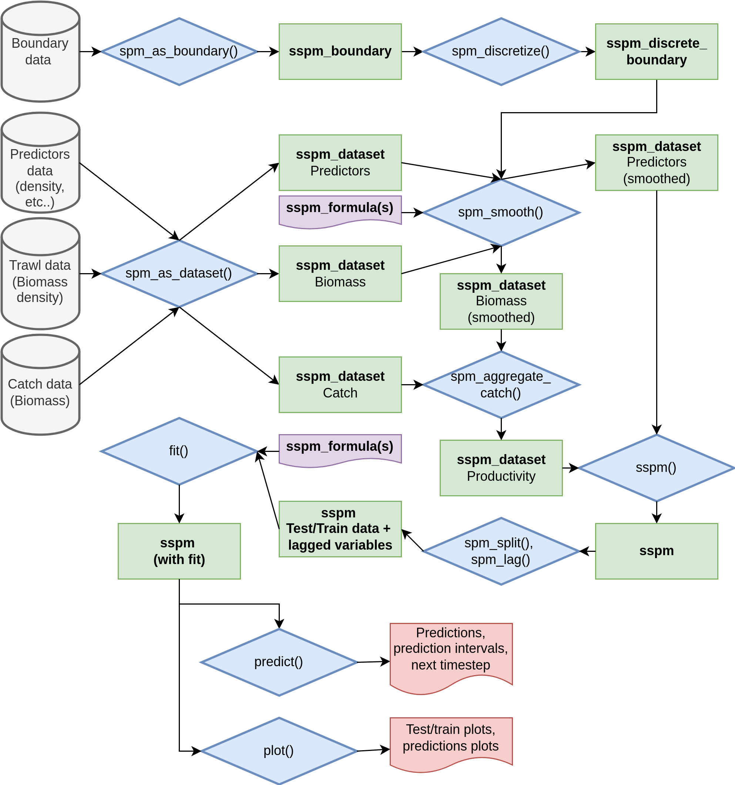

# Abstract

Productivity models such as Surplus Production Models (SPMs) models can be used to inform stock management of fisheries. However, those models often share three main flaws: (1) they are usually not spatially explicit, (2) fail to incorporate ecosystem predictors and therefore are ill-suited to ecosystem-based management of stocks, and (3) their deployment is often limited by code availability, quality and accessibility. To fill this gap, we developed a lag-1 autoregressive SSPM based on Generalized Additive Models (GAMs), broadly applicable to spatially-structured populations, and bundled into an R package. We applied this model to one of the most economically important invertebrate populations in Canadian waters, Northern Shrimp (Pandalus borealis) in the Newfoundland and Labrador Shelves. This stock currently lacks a population model to predict how fishing pressure and changing environmental conditions may affect future shrimp abundance in the region. Our model incorporates relevant ecosystem predictors for this stock, such as Atlantic Cod (Gadus morhua) density, alternate predator density, temperature, and stock biomass. In addition, the model is deployed through the R package sspm, a flexible framework aimed at making SSPMs easier to apply to spatially structured populations. The package allows for a repeatable and open workflow and improves the accessibility of SSPMs.

# Summary

TBD

# Statement of need

1. The Northern Shrimp stock in the Newfoundland and Labrador Shelves currently lacks a population model
2. Current SPM models are rarely spatially explicit and isually cannot account for relevent ecosystem drivers
3. Fisheries managers lack user-friendly, flexible tools to implement and apply Spatial SPMs

# Introduction

(1) Modelling spatially-structured populations => of interest
(2) Especially of interest by fisheries models
(3) Process based models vs statistical models 
(4) SPM models => but still lack ability to go about uncertainty
(5) In this paper, we develop a model...
(6) We apply this model to the Shrimp Fishery (some background)
(7) We make this tool flexible and user-friendly: This is an R package

# Model

Rho => varying prod => covariance matrix => precision => basis functions and Gams

# Results

The GAM biomass estimates are consistent with those of the current tool in use for the assessment of the stock, Ogmap, and provide valuable insights about the drivers of the rapid increase and decline of shrimp in the southern end of the shelf. Our approach demonstrates the model’s ability to become a useful tool for modelling spatially-structured populations like fisheries stocks. The sspm package successfully modularizes each step of the modelling process and implements a range of useful features for modeling spatially-structured populations: spatial discretization, simplified GAM syntax, prediction intervals and scenario based forecasts for longer-term trends. In a fisheries context, It illustrates how our model can be easily used by managers to forecast fisheries productivity under different management regimes. The package is also a tool to think about design choices when conceiving a user interface for managers and on best practices when it comes to adapting research code into management tools. Finally, our approach demonstrates how open source software tools can improve the accessibility and reliability of models for fisheries management.

# Package design

<!--{ width=90% }-->

# Application to simulated data

# Citations

Citations to entries in paper.bib should be in
[rMarkdown](http://rmarkdown.rstudio.com/authoring_bibliographies_and_citations.html)
format.

If you want to cite a software repository URL (e.g. something on GitHub without a preferred
citation) then you can do it with the example BibTeX entry below for @fidgit.

For a quick reference, the following citation commands can be used:
- `@author:2001`  ->  "Author et al. (2001)"
- `[@author:2001]` -> "(Author et al., 2001)"
- `[@author1:2001; @author2:2001]` -> "(Author1 et al., 2001; Author2 et al., 2002)"

# Figures
<!--
Figures can be included like this:

and referenced from text using \autoref{fig:example}.

Figure sizes can be customized by adding an optional second parameter:
{ width=20% }-->

# Acknowledgements

TBD

# References
